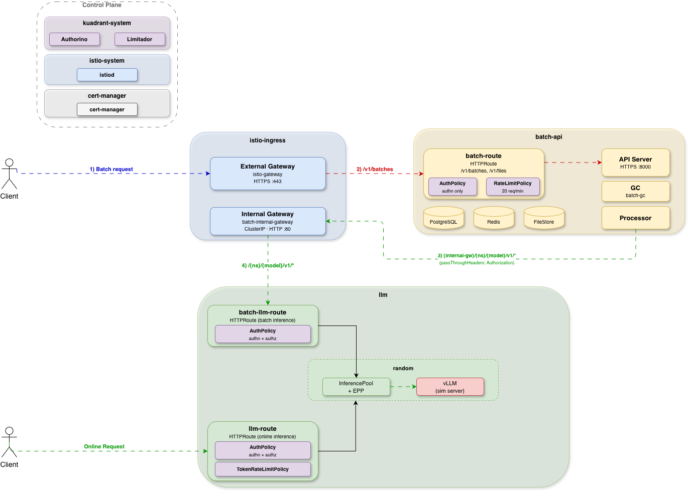

# Batch Gateway on Kubernetes

This guide demonstrates how to deploy batch-gateway on vanilla Kubernetes (or OpenShift) using open-source Helm charts. It uses the [llm-d](https://llm-d.ai) stack (Istio + llm-d Router + vLLM) and [Kuadrant](https://kuadrant.io/) for authentication, authorization, and rate limiting.

## Quick Start

For a one-click deployment, use the automated script from the **repository root**:

```bash
cd /path/to/batch-gateway   # all commands assume you are at the repo root

bash examples/deploy-demo/deploy-k8s.sh install   # deploy everything
bash examples/deploy-demo/deploy-k8s.sh test       # run all tests
bash examples/deploy-demo/deploy-k8s.sh uninstall  # tear down (UNINSTALL_ALL=1 for full cleanup)
```

See [deploy-demo/deploy-k8s.md](../../examples/deploy-demo/deploy-k8s.md) for script options and environment variables.

The sections below walk through each step manually for understanding and customization.

## 1. Architecture

### 1.1 Namespace Layout

| Namespace | Purpose |
|-----------|---------|
| `istio-system` | Istio control plane (istiod) |
| `istio-ingress` | Gateway data plane (Istio/Envoy proxy) |
| `cert-manager` | cert-manager controller, webhook, cainjector |
| `kuadrant-system` | Kuadrant operator, Authorino, Limitador |
| `batch-api` | batch-gateway (apiserver + processor + gc), Redis, PostgreSQL |
| `llm` | llm-d stack: InferencePool, EPP, vLLM |

### 1.2 Data Flow



**Batch inference flow**:
1. Client sends a batch request (e.g. `POST /v1/batches`) to the External Gateway (`istio-gateway`, HTTPS :443) with a Kubernetes token
2. Gateway matches `/v1/batches`, `/v1/files` → **batch-route** (HTTPRoute)
    - **AuthPolicy** on the batch-route performs authentication only (kubernetesTokenReview, no authorization check) — unauthenticated requests are rejected with 401
    - **RateLimitPolicy** on the batch-route enforces per-user request rate limiting (e.g. 20 req/min), keyed by Kubernetes username (user or ServiceAccount) from TokenReview — excess requests are rejected with 429
    - Authenticated request is forwarded to **batch-gateway apiserver**, which stores the batch job
3. **Processor** dequeues the batch job and sends inference requests to the **Internal Gateway** (`batch-internal-gateway`, ClusterIP HTTP :80) with the user's original token (via `passThroughHeaders: [Authorization]`)
4. The Internal Gateway matches `/{ns}/{model}/v1/*` → **batch-llm-route** (HTTPRoute)
    - **AuthPolicy** on the batch-llm-route performs authentication and authorization (SubjectAccessReview — checks if the original user can `get inferencepools/<model-name>`, where `<model-name>` is extracted from the URL path, not the backend InferencePool object name) — if the user lacks permission, the request is rejected with 403
    - No **TokenRateLimitPolicy** on the batch-llm-route — batch inference requests bypass per-user token rate limiting
5. Request is routed to **InferencePool** → **EPP** (endpoint picker) → **vLLM** model server, and the response is returned to the Processor, which adds the response to the batch job's output file
    - The Processor sets the `x-gateway-inference-objective: batch-sheddable` header, which assigns the request to the **batch priority band (priority -1)** in EPP's flow control. This band is **sheddable** — when the backend is saturated, batch requests are rejected immediately instead of queued, and the Processor retries with backoff

**Async dispatch flow** (when `ENABLE_DISPATCHER=true`):

Steps 1–2 are the same as above. Steps 3–5 change:

3. **Processor** dequeues the batch job and sends inference requests to a **Redis queue** (keyed by `inferencePoolName`) instead of making HTTP calls directly. The user's Authorization header is included in the queue message (via `passThroughHeaders`)
4. **async-processor** ([llm-d-async](https://github.com/llm-d/llm-d-async)) reads from the Redis queue and sends the request to the **Internal Gateway** with the user's original token (pass-through headers)
5. The Internal Gateway routes through **batch-llm-route** → **InferencePool** → **EPP** → **vLLM** as before. The async-processor writes the result back to a Redis result queue, which the Processor reads to complete the batch job

**Online inference flow**:
1. Client sends an inference request (e.g. `POST /{ns}/{model}/v1/chat/completions`) to the External Gateway with a Kubernetes token
2. Gateway matches `/{ns}/{model}/v1/*` → **llm-route** (HTTPRoute, manually created with URL rewrite rules)
    - **AuthPolicy** on the llm-route performs authentication and authorization (SubjectAccessReview — same model access check as the batch-llm-route)
    - **TokenRateLimitPolicy** on the llm-route enforces per-user token rate limiting, keyed by Kubernetes username from TokenReview
3. Request is routed to **InferencePool** → **EPP** → **vLLM** model server
    - Interactive requests without an `x-gateway-inference-objective` header default to **priority 0**, which outranks the batch band (priority -1). Requests with `x-gateway-inference-objective: interactive-default` are assigned to **priority 100**

> **Why two gateways?** The Internal Gateway is a ClusterIP-only Envoy proxy that is not accessible from outside the cluster. The batch processor uses it to bypass the TokenRateLimitPolicy applied on the External Gateway's llm-route. This ensures batch jobs are not throttled by per-user token rate limits intended for interactive use. The Internal Gateway's batch-llm-route still enforces AuthPolicy (authentication + model authorization), so unauthorized access is always blocked.

> **Why flow control?** Without flow control, batch and interactive requests compete equally for backend resources. Under heavy batch load, interactive latency spikes because the backend is saturated with batch requests. Flow control solves this with priority-based dispatch: interactive requests (priority 0/100) are always dispatched before batch requests (priority -1). When the backend is saturated, batch requests are shed (rejected immediately) rather than queued, and the batch processor retries with backoff. This ensures interactive traffic always gets low-latency treatment while batch fills remaining capacity. See [Flow Control Setup](flow-control-setup.md) for detailed configuration.

### 1.3 Authentication

Both the LLM route and the batch route use **kubernetesTokenReview** for authentication. Clients must provide a valid Kubernetes token via the `Authorization: Bearer <token>` header. The token must include the audience `https://kubernetes.default.svc`.

```bash
# Create a token for a ServiceAccount
kubectl create token <sa-name> -n <namespace> --audience=https://kubernetes.default.svc --duration=10m
```

HTTPRoute authentication behavior:
- **LLM route**: Requires a valid Kubernetes token — unauthenticated requests are rejected with **401**
- **Batch route**: Requires a valid Kubernetes token — unauthenticated requests are rejected with **401**

### 1.4 Authorization Model

Users need RBAC `get` permission on the `inferencepools` resource whose name matches the **model name in the URL path**. The AuthPolicy extracts the resource name from the URL via `request.path.split("/")[2]`.

> **Important**: The SAR resource name (derived from the URL path segment) is **independent** of the HTTPRoute backend `InferencePool` metadata name. Which `InferencePool` a given path segment routes to is determined by **routing** (the HTTPRoute / route map), not by SAR. SAR controls *who* can access a model endpoint; the HTTPRoute controls *where* that endpoint's traffic is sent. For example, a URL path segment `random` may route to an `InferencePool` named `llmd` — the RBAC `resourceNames` should use the URL path segment (`random`), not the `InferencePool` object name.

To grant access, create a Role and RoleBinding:

> **Note**: Unlike RHOAI (which checks `llminferenceservices`), the k8s deployment checks `inferencepools` because the llm-route directly references InferencePool backends.

```bash
kubectl apply -f - <<EOF
apiVersion: rbac.authorization.k8s.io/v1
kind: Role
metadata:
  name: model-access
  namespace: <llm-namespace>
rules:
- apiGroups: ["inference.networking.k8s.io"]
  resources: ["inferencepools"]
  resourceNames: ["<model-name>"]   # must match the model name in the URL path /{namespace}/{model-name}/v1/*
  verbs: ["get"]
---
apiVersion: rbac.authorization.k8s.io/v1
kind: RoleBinding
metadata:
  name: model-access-binding
  namespace: <llm-namespace>
subjects:
- kind: ServiceAccount
  name: <sa-name>
  namespace: <llm-namespace>
roleRef:
  kind: Role
  name: model-access
  apiGroup: rbac.authorization.k8s.io
EOF
```

Verify that the user has access:

```bash
kubectl auth can-i get inferencepools/<model-name> -n <llm-namespace> --as=system:serviceaccount:<namespace>:<sa-name>
# Expected output: yes
```

HTTPRoute authorization behavior:
- **llm-route** / **batch-llm-route**: SubjectAccessReview checks if user can `get inferencepools/<model-name>` (extracted from URL path) — unauthorized requests are rejected with **403**
- **batch-route**: No authorization check — authorization is enforced by the **batch-llm-route** (on the Internal Gateway) when the processor forwards inference requests with the user's original token

### 1.5 Security boundary: batch-route vs batch-llm-route vs llm-route

For security and operations readers: **admission on the batch API is not the same as authorization for inference.**

- **batch-route** (External Gateway) proves the caller has a valid Kubernetes token and applies batch-side **RateLimitPolicy**. Invalid or missing credentials are rejected with **401**; excess batch API traffic is rejected with **429**. It does **not** evaluate whether the caller may use a specific model.
- **batch-llm-route** (Internal Gateway) runs **authentication and authorization** (SubjectAccessReview on `inferencepools`) on each inference request the processor sends. This route does **not** have a TokenRateLimitPolicy, so batch inference is not token-rate-limited. A user can create a batch job and still see **per-request failures** (often surfaced as failed lines or job errors) when the batch-llm-route returns **403** — this is **by design**, not a bypass of model access control.
- **llm-route** (External Gateway) runs **authentication, authorization, and token rate limiting** on each online inference request. This is the user-facing inference endpoint.

The `Authorization` header is included in `passThroughHeaders`, so the processor forwards the end user's bearer token on inference calls automatically. Without it, the Internal Gateway cannot attribute inference traffic to the original caller and model-level checks cannot run as intended.

## 2. Prerequisites

- Kubernetes cluster (or OpenShift 4.x)
- CLI tools: `kubectl`, `helm`, `git`, `curl`, `jq`, `yq`
- All commands below assume you are at the **batch-gateway repository root** (where `charts/` and `examples/` are located)

### Environment Variables

Set these once before running any installation or test step. All subsequent code blocks reference these variables.

```bash
# Gateway
export GATEWAY_NAME=istio-gateway
export GATEWAY_NAMESPACE=istio-ingress
export BATCH_INTERNAL_GATEWAY_NAME=batch-internal-gateway
export BATCH_INTERNAL_GATEWAY_NAMESPACE=${GATEWAY_NAMESPACE}   # defaults to same as external gateway

# Namespaces
export LLM_NAMESPACE=llm
export BATCH_NAMESPACE=batch-api
export KUADRANT_NAMESPACE=kuadrant-system

# Component versions
export CERT_MANAGER_VERSION=v1.20.3
export KUADRANT_VERSION=1.3.1
export ISTIO_VERSION=1.29.2
export LLMD_VERSION=v0.8.1
export LLMD_GIT_DIR="/tmp/llm-d-${LLMD_VERSION}"

# llm-d model
export LLMD_RELEASE_POSTFIX=llmd
export LLMD_POOL_NAME=${LLMD_RELEASE_POSTFIX}
export MODEL_NAME=random

# Flow control
export INTERACTIVE_FLOW_CONTROL_OBJECTIVE=interactive-default
export BATCH_FLOW_CONTROL_OBJECTIVE=batch-sheddable

# Async dispatcher (optional — set ENABLE_DISPATCHER=true to use)
export ENABLE_DISPATCHER=false
export DISPATCHER_VERSION=v0.7.3
```

> **Note**: `GAIE_VERSION`, `ROUTER_CHART_VERSION`, and `ROUTER_GATEWAY_CHART` are automatically sourced from the llm-d repo's `guides/env.sh` after cloning (see step 3.2). You do not need to set them manually.
>
> **Note**: These variable names match the deploy script (`deploy-k8s.sh`), so values exported here will take effect if you run the script afterwards.

## 3. Installation Steps

### 3.1 Install cert-manager

<details>
<summary>Install cert-manager via Helm</summary>

```bash
helm repo add jetstack https://charts.jetstack.io --force-update
helm upgrade --install cert-manager jetstack/cert-manager \
    --namespace cert-manager \
    --create-namespace \
    --version "${CERT_MANAGER_VERSION}" \
    --set crds.enabled=true

# Wait for deployments
kubectl rollout status deploy/cert-manager -n cert-manager --timeout=120s
kubectl rollout status deploy/cert-manager-webhook -n cert-manager --timeout=120s
kubectl rollout status deploy/cert-manager-cainjector -n cert-manager --timeout=120s
```

</details>

<details>
<summary>Create a self-signed ClusterIssuer</summary>

```bash
kubectl apply -f - <<'EOF'
apiVersion: cert-manager.io/v1
kind: ClusterIssuer
metadata:
  name: selfsigned-issuer
spec:
  selfSigned: {}
EOF
```

</details>

### 3.2 Install llm-d Dependencies (CRDs)

Install Gateway API and GAIE CRDs from the [llm-d repository](https://github.com/llm-d/llm-d), following the [official quickstart](https://llm-d.ai/docs/getting-started/quickstart) pattern.

<details>
<summary>Clone llm-d and install CRDs</summary>

```bash
# Clone llm-d repo and source version variables
git clone --depth 1 --branch "${LLMD_VERSION}" \
    https://github.com/llm-d/llm-d.git "${LLMD_GIT_DIR}"
source "${LLMD_GIT_DIR}/guides/env.sh"

# Install Gateway API + GAIE CRDs (pre-installed on OpenShift; needed on vanilla k8s)
bash "${LLMD_GIT_DIR}/guides/recipes/gateway/install-gateway-crds.sh"

# Install llm-d Router CRDs (InferenceObjective etc.)
kubectl apply -f "https://github.com/llm-d/llm-d-router/releases/download/${ROUTER_CHART_VERSION}/manifests.yaml"
```

</details>

### 3.3 Install Istio

<details>
<summary>Install Istio via Helm</summary>

```bash
helm repo add istio https://istio-release.storage.googleapis.com/charts --force-update

helm install istio-base istio/base \
    --namespace istio-system \
    --create-namespace \
    --version "${ISTIO_VERSION}"

helm install istiod istio/istiod \
    --namespace istio-system \
    --version "${ISTIO_VERSION}" \
    --set pilot.env.ENABLE_GATEWAY_API_INFERENCE_EXTENSION=true \
    --wait

kubectl rollout status deploy/istiod -n istio-system --timeout=300s
```

</details>

### 3.4 Install Kuadrant

<details>
<summary>Install Kuadrant operator via Helm</summary>

```bash
helm repo add kuadrant https://kuadrant.io/helm-charts/ --force-update
helm upgrade --install kuadrant-operator kuadrant/kuadrant-operator \
    --version "${KUADRANT_VERSION}" \
    --create-namespace \
    --namespace "${KUADRANT_NAMESPACE}"

# Wait for operator deployments
kubectl rollout status deploy/authorino-operator -n ${KUADRANT_NAMESPACE} --timeout=120s
kubectl rollout status deploy/kuadrant-operator-controller-manager -n ${KUADRANT_NAMESPACE} --timeout=120s
kubectl rollout status deploy/limitador-operator-controller-manager -n ${KUADRANT_NAMESPACE} --timeout=120s
```

</details>

<details>
<summary>Create Kuadrant CR</summary>

```bash
kubectl apply -f - <<EOF
apiVersion: kuadrant.io/v1beta1
kind: Kuadrant
metadata:
  name: kuadrant
  namespace: ${KUADRANT_NAMESPACE}
spec: {}
EOF

# Wait for kuadrant instance to be ready
kubectl wait kuadrant/kuadrant --for="condition=Ready=true" \
    -n "${KUADRANT_NAMESPACE}" --timeout=300s
```

</details>

### 3.5 Create Gateway and TLS Certificate

<details>
<summary>Create TLS Certificate for Gateway</summary>

```bash
kubectl create namespace "${GATEWAY_NAMESPACE}" 2>/dev/null || true

kubectl apply -f - <<EOF
apiVersion: cert-manager.io/v1
kind: Certificate
metadata:
  name: ${GATEWAY_NAME}-tls
  namespace: ${GATEWAY_NAMESPACE}
spec:
  secretName: ${GATEWAY_NAME}-tls
  issuerRef:
    name: selfsigned-issuer
    kind: ClusterIssuer
  dnsNames:
  - "*.${GATEWAY_NAMESPACE}.svc.cluster.local"
  - localhost
EOF

kubectl wait --for=condition=Ready --timeout=60s \
    -n "${GATEWAY_NAMESPACE}" certificate/${GATEWAY_NAME}-tls
```

</details>

<details>
<summary>Create the Istio Gateway (HTTP + HTTPS)</summary>

```bash
kubectl apply -f - <<EOF
apiVersion: gateway.networking.k8s.io/v1
kind: Gateway
metadata:
  name: ${GATEWAY_NAME}
  namespace: ${GATEWAY_NAMESPACE}
  labels:
    kuadrant.io/gateway: "true"
spec:
  gatewayClassName: istio
  listeners:
  - name: http
    protocol: HTTP
    port: 80
    allowedRoutes:
      namespaces:
        from: Selector
        selector:
          matchLabels:
            llm-d.ai/gateway-route: "true"
  - name: https
    protocol: HTTPS
    port: 443
    tls:
      mode: Terminate
      certificateRefs:
      - name: ${GATEWAY_NAME}-tls
    allowedRoutes:
      namespaces:
        from: Selector
        selector:
          matchLabels:
            llm-d.ai/gateway-route: "true"
EOF

# Wait for gateway to be programmed
kubectl wait --for=condition=Programmed --timeout=300s \
    -n "${GATEWAY_NAMESPACE}" gateway/${GATEWAY_NAME}
```

> **Note**: The Gateway uses a self-signed certificate from cert-manager (not OpenShift router certs). Access via `kubectl port-forward` with `-k` (insecure) flag on curl.

> **Security**: The Gateway uses `allowedRoutes.namespaces.from: Selector` to restrict HTTPRoute attachment. Only namespaces labeled with `llm-d.ai/gateway-route: "true"` can attach HTTPRoutes. This must be applied to the batch and LLM namespaces before creating their HTTPRoutes CRs.

</details>

### 3.6 Deploy model with llm-d

Deploy the llm-d Router (gateway mode) and model server, following the [official llm-d quickstart](https://llm-d.ai/docs/getting-started/quickstart) pattern with sim-specific overlays.

```bash
# Create the LLM namespace
kubectl create namespace "${LLM_NAMESPACE}" 2>/dev/null || true
kubectl label namespace "${LLM_NAMESPACE}" llm-d.ai/gateway-route=true --overwrite
```

<details>
<summary>Install llm-d Router (gateway mode) with flow control</summary>

The Router chart deploys the InferencePool, EPP (Endpoint Picker), and RBAC. Following the official layered values pattern, we use `base.values.yaml` from the llm-d repo + sim-specific overlay + flow control overlay.

```bash
EPP_HOST="${LLMD_POOL_NAME}-epp.${LLM_NAMESPACE}.svc.cluster.local"

helm upgrade --install "${LLMD_POOL_NAME}" \
    oci://ghcr.io/llm-d/charts/llm-d-router-gateway \
    --version "${ROUTER_CHART_VERSION}" \
    --namespace "${LLM_NAMESPACE}" \
    -f "${LLMD_GIT_DIR}/guides/recipes/router/base.values.yaml" \
    -f examples/deploy-demo/llmd-sim/router/sim-values.yaml \
    -f examples/deploy-demo/llmd-sim/router/overlays/flow-control.yaml \
    --set provider.name=istio \
    --set "provider.istio.destinationRule.host=${EPP_HOST}"
```

> **Flow control overlay**: The flow-control overlay sets `pluginsConfigFile: flow-control-plugins.yaml` and configures the `EndpointPickerConfig` with the `flowControl` feature gate, two priority bands (interactive: 100, batch: -1), and a concurrency-based saturation detector. See [Flow Control Setup](flow-control-setup.md) for details.
>
> **Disabling flow control**: To deploy without flow control, omit the `-f .../overlays/flow-control.yaml` line above and skip the InferenceObjective creation step below. Also omit `processor.config.modelGateways.<model>.inferenceObjective` when installing batch-gateway (step 3.8).

</details>

<details>
<summary>Deploy model server (vllm-sim) via kustomize</summary>

```bash
kubectl apply -n "${LLM_NAMESPACE}" -k examples/deploy-demo/llmd-sim/modelserver/

# Wait for deployments
kubectl rollout status deploy/${LLMD_POOL_NAME}-epp -n ${LLM_NAMESPACE} --timeout=300s
kubectl rollout status deploy/llmd-sim-decode -n ${LLM_NAMESPACE} --timeout=300s
```

</details>

<details>
<summary>Create InferenceObjective resources</summary>

InferenceObjective resources assign requests to priority bands based on the `x-gateway-inference-objective` header. Create one for interactive traffic (priority 100) and one for batch traffic (priority -1, sheddable).

```bash
kubectl apply -f - <<EOF
apiVersion: llm-d.ai/v1alpha2
kind: InferenceObjective
metadata:
  name: ${INTERACTIVE_FLOW_CONTROL_OBJECTIVE}
  namespace: ${LLM_NAMESPACE}
spec:
  priority: 100
  poolRef:
    name: ${LLMD_POOL_NAME}
---
apiVersion: llm-d.ai/v1alpha2
kind: InferenceObjective
metadata:
  name: ${BATCH_FLOW_CONTROL_OBJECTIVE}
  namespace: ${LLM_NAMESPACE}
spec:
  priority: -1
  poolRef:
    name: ${LLMD_POOL_NAME}
EOF
```

Verify the objectives:

```bash
kubectl get inferenceobjective -n ${LLM_NAMESPACE}
```

</details>

### 3.7 Configure HTTPRoute and Policies for LLM model

<details>
<summary>Create HTTPRoute for LLM inference</summary>

The llm-route is manually created with URL rewrite rules that map `/{namespace}/{model}/v1/*` to the InferencePool backend.

```bash
kubectl apply -f - <<EOF
apiVersion: gateway.networking.k8s.io/v1
kind: HTTPRoute
metadata:
  name: llm-route
  namespace: ${LLM_NAMESPACE}
spec:
  parentRefs:
  - name: ${GATEWAY_NAME}
    namespace: ${GATEWAY_NAMESPACE}
  rules:
  - matches:
    - path:
        type: PathPrefix
        value: /${LLM_NAMESPACE}/${MODEL_NAME}/v1/completions
    filters:
    - type: URLRewrite
      urlRewrite:
        path:
          type: ReplacePrefixMatch
          replacePrefixMatch: /v1/completions
    backendRefs:
    - group: inference.networking.k8s.io
      kind: InferencePool
      name: ${LLMD_POOL_NAME}
  - matches:
    - path:
        type: PathPrefix
        value: /${LLM_NAMESPACE}/${MODEL_NAME}/v1/chat/completions
    filters:
    - type: URLRewrite
      urlRewrite:
        path:
          type: ReplacePrefixMatch
          replacePrefixMatch: /v1/chat/completions
    backendRefs:
    - group: inference.networking.k8s.io
      kind: InferencePool
      name: ${LLMD_POOL_NAME}
EOF
```

> **Note**: Unlike RHOAI where `LLMInferenceService` auto-generates the HTTPRoute, the k8s deployment requires a manually created llm-route with explicit URL rewrite rules.

</details>

<details>
<summary>Create AuthPolicy for LLM route (authentication + authorization)</summary>

```bash
kubectl apply -f - <<EOF
apiVersion: kuadrant.io/v1
kind: AuthPolicy
metadata:
  name: llm-route-auth
  namespace: ${LLM_NAMESPACE}
spec:
  targetRef:
    group: gateway.networking.k8s.io
    kind: HTTPRoute
    name: llm-route
  rules:
    authentication:
      kubernetes-user:
        kubernetesTokenReview:
          audiences:
          - https://kubernetes.default.svc
    authorization:
      model-access:
        kubernetesSubjectAccessReview:
          user:
            expression: auth.identity.user.username
          authorizationGroups:
            expression: auth.identity.user.groups
          resourceAttributes:
            group:
              value: inference.networking.k8s.io
            resource:
              value: inferencepools
            namespace:
              expression: request.path.split("/")[1]
            name:
              expression: request.path.split("/")[2]
            verb:
              value: get
EOF
```

> **Note**: The authorization uses `inferencepools` (not `llminferenceservices` as in RHOAI). The `request.path.split("/")[2]` extracts the **model name** from the URL path `/{namespace}/{model}/...` for the SAR check. This is the user-facing model name, not the backend `InferencePool` object name — the HTTPRoute determines which `InferencePool` actually receives traffic for each path prefix (see [Section 1.4](#14-authorization-model)).

</details>

<details>
<summary>Create TokenRateLimitPolicy for LLM route</summary>

```bash
kubectl apply -f - <<EOF
apiVersion: kuadrant.io/v1alpha1
kind: TokenRateLimitPolicy
metadata:
  name: inference-token-limit
  namespace: ${LLM_NAMESPACE}
spec:
  targetRef:
    group: gateway.networking.k8s.io
    kind: HTTPRoute
    name: llm-route
  limits:
    per-user:
      rates:
      - limit: 500
        window: 1m
      when:
      - predicate: request.path.endsWith("/v1/chat/completions")
      counters:
      - expression: auth.identity.user.username
EOF

kubectl wait tokenratelimitpolicy/inference-token-limit \
    --for="condition=Enforced=true" \
    -n ${LLM_NAMESPACE} --timeout=120s
```

> **Note**: The TokenRateLimitPolicy targets the HTTPRoute (not the Gateway), because the llm-route is manually created with a stable name.

</details>

### 3.8 Batch Gateway Dependencies

The batch processor routes inference requests through a separate, ClusterIP-only Internal Gateway to bypass the TokenRateLimitPolicy on the External Gateway while still enforcing model-level authorization (AuthPolicy).

<details>
<summary>Create Internal Gateway (ClusterIP)</summary>

```bash
kubectl apply -f - <<EOF
apiVersion: gateway.networking.k8s.io/v1
kind: Gateway
metadata:
  name: ${BATCH_INTERNAL_GATEWAY_NAME}
  namespace: ${BATCH_INTERNAL_GATEWAY_NAMESPACE}
  annotations:
    networking.istio.io/service-type: ClusterIP
spec:
  gatewayClassName: istio
  listeners:
  - name: http
    port: 80
    protocol: HTTP
    allowedRoutes:
      namespaces:
        from: Selector
        selector:
          matchLabels:
            llm-d.ai/gateway-route: "true"
EOF

kubectl wait --for=condition=Programmed --timeout=300s \
    -n "${BATCH_INTERNAL_GATEWAY_NAMESPACE}" gateway/${BATCH_INTERNAL_GATEWAY_NAME}
```

> **Note**: The `networking.istio.io/service-type: ClusterIP` annotation ensures the Internal Gateway's Service is ClusterIP-only (no LoadBalancer, no external IP). This prevents direct external access — all external traffic must go through the External Gateway.

</details>

<details>
<summary>Create batch-llm-route (HTTPRoute on Internal Gateway)</summary>

The batch-llm-route is attached to the Internal Gateway and has the same URL rewrite rules as the llm-route, but targets the Internal Gateway instead of the External Gateway.

```bash
kubectl apply -f - <<EOF
apiVersion: gateway.networking.k8s.io/v1
kind: HTTPRoute
metadata:
  name: batch-llm-route
  namespace: ${LLM_NAMESPACE}
spec:
  parentRefs:
  - name: ${BATCH_INTERNAL_GATEWAY_NAME}
    namespace: ${BATCH_INTERNAL_GATEWAY_NAMESPACE}
  rules:
  - matches:
    - path:
        type: PathPrefix
        value: /${LLM_NAMESPACE}/${MODEL_NAME}/v1/completions
    filters:
    - type: URLRewrite
      urlRewrite:
        path:
          type: ReplacePrefixMatch
          replacePrefixMatch: /v1/completions
    backendRefs:
    - group: inference.networking.k8s.io
      kind: InferencePool
      name: ${LLMD_POOL_NAME}
  - matches:
    - path:
        type: PathPrefix
        value: /${LLM_NAMESPACE}/${MODEL_NAME}/v1/chat/completions
    filters:
    - type: URLRewrite
      urlRewrite:
        path:
          type: ReplacePrefixMatch
          replacePrefixMatch: /v1/chat/completions
    backendRefs:
    - group: inference.networking.k8s.io
      kind: InferencePool
      name: ${LLMD_POOL_NAME}
EOF
```

</details>

<details>
<summary>Create AuthPolicy for batch-llm-route (authentication + authorization)</summary>

```bash
kubectl apply -f - <<EOF
apiVersion: kuadrant.io/v1
kind: AuthPolicy
metadata:
  name: batch-llm-route-auth
  namespace: ${LLM_NAMESPACE}
spec:
  targetRef:
    group: gateway.networking.k8s.io
    kind: HTTPRoute
    name: batch-llm-route
  rules:
    authentication:
      kubernetes-user:
        kubernetesTokenReview:
          audiences:
          - https://kubernetes.default.svc
    authorization:
      model-access:
        kubernetesSubjectAccessReview:
          user:
            expression: auth.identity.user.username
          authorizationGroups:
            expression: auth.identity.user.groups
          resourceAttributes:
            group:
              value: inference.networking.k8s.io
            resource:
              value: inferencepools
            namespace:
              expression: request.path.split("/")[1]
            name:
              expression: request.path.split("/")[2]
            verb:
              value: get
EOF
```

> **Note**: The batch-llm-route has AuthPolicy (authentication + authorization) but **no TokenRateLimitPolicy**. This is intentional — batch inference requests should not be throttled by per-user token rate limits. The External Gateway's llm-route handles token rate limiting for online (interactive) requests only.

</details>

Deploy batch-gateway with the model gateway URL pointing to the Internal Gateway:

<details>
<summary>Create namespace and install dependencies</summary>

```bash
kubectl create namespace "${BATCH_NAMESPACE}" 2>/dev/null || true
kubectl label namespace "${BATCH_NAMESPACE}" llm-d.ai/gateway-route=true --overwrite

# Install Redis (or Valkey — see alternative below)
helm upgrade --install redis oci://registry-1.docker.io/bitnamicharts/redis \
    --namespace ${BATCH_NAMESPACE} --create-namespace \
    --set architecture=standalone \
    --set auth.enabled=false
kubectl rollout status statefulset/redis-master -n ${BATCH_NAMESPACE} --timeout=120s

# Alternative: Install Valkey (wire-protocol compatible with Redis)
# helm upgrade --install redis oci://registry-1.docker.io/bitnamicharts/valkey \
#     --namespace ${BATCH_NAMESPACE} --create-namespace \
#     --set architecture=standalone \
#     --set auth.enabled=false
# kubectl rollout status statefulset/redis-valkey-primary -n ${BATCH_NAMESPACE} --timeout=120s
# Note: when using Valkey, update the redis-url secret below to use:
#   redis://redis-valkey-primary.${BATCH_NAMESPACE}.svc.cluster.local:6379/0

# Install PostgreSQL
helm upgrade --install postgresql oci://registry-1.docker.io/bitnamicharts/postgresql \
    --namespace ${BATCH_NAMESPACE} --create-namespace \
    --set auth.postgresPassword=<your-postgres-password> \
    --set auth.database=batch
kubectl rollout status statefulset/postgresql -n ${BATCH_NAMESPACE} --timeout=120s

# Install MinIO (S3-compatible object storage for batch files)
MINIO_USER=<your-minio-user>
MINIO_PASSWORD=<your-minio-password>
MINIO_BUCKET=llm-d-batch-gateway
MINIO_REGION=us-east-1

kubectl apply -f - <<EOF
apiVersion: apps/v1
kind: Deployment
metadata:
  name: minio
  namespace: ${BATCH_NAMESPACE}
  labels:
    app: minio
spec:
  replicas: 1
  selector:
    matchLabels:
      app: minio
  template:
    metadata:
      labels:
        app: minio
    spec:
      containers:
      - name: minio
        image: quay.io/minio/minio:RELEASE.2024-12-18T13-15-44Z
        args: ["server", "/data", "--console-address", ":9001"]
        env:
        - name: MINIO_ROOT_USER
          value: "${MINIO_USER}"
        - name: MINIO_ROOT_PASSWORD
          value: "${MINIO_PASSWORD}"
        ports:
        - containerPort: 9000
          name: api
        - containerPort: 9001
          name: console
        volumeMounts:
        - name: data
          mountPath: /data
      volumes:
      - name: data
        emptyDir: {}
---
apiVersion: v1
kind: Service
metadata:
  name: minio
  namespace: ${BATCH_NAMESPACE}
  labels:
    app: minio
spec:
  selector:
    app: minio
  ports:
  - name: api
    port: 9000
    targetPort: 9000
  - name: console
    port: 9001
    targetPort: 9001
  type: ClusterIP
EOF

until kubectl get deployment minio -n ${BATCH_NAMESPACE} &>/dev/null; do sleep 5; done
kubectl rollout status deployment/minio -n ${BATCH_NAMESPACE} --timeout=180s

# Create application secret
kubectl create secret generic batch-gateway-secrets \
    --namespace ${BATCH_NAMESPACE} \
    --from-literal=redis-url="redis://redis-master.${BATCH_NAMESPACE}.svc.cluster.local:6379/0" \
    --from-literal=postgresql-url="postgresql://postgres:<your-postgres-password>@postgresql.${BATCH_NAMESPACE}.svc.cluster.local:5432/batch?sslmode=disable" \
    --from-literal=s3-secret-access-key="${MINIO_PASSWORD}" \
    --dry-run=client -o yaml | kubectl apply -f -
```

> **Note**: Redis auth and PostgreSQL persistence are disabled for demo purposes. For production, enable Redis authentication and configure persistent storage.

</details>

### 3.9 Install Batch Gateway

Choose **one** of the two dispatch modes below (sync or async).

#### 3.9.1 Option 1: Sync dispatch (default)

<details>
<summary>Sync dispatch: processor sends inference requests directly to the Internal Gateway</summary>

```bash
# Discover the Internal Gateway's Service (ClusterIP, HTTP :80)
INTERNAL_GW_SVC=$(kubectl get svc -n ${BATCH_INTERNAL_GATEWAY_NAMESPACE} \
    -l "gateway.networking.k8s.io/gateway-name=${BATCH_INTERNAL_GATEWAY_NAME}" \
    -o jsonpath='{.items[0].metadata.name}')

# Model gateway URL: route through the Internal Gateway (which has AuthPolicy but no TokenRateLimitPolicy)
MODEL_GW_URL="http://${INTERNAL_GW_SVC}.${BATCH_INTERNAL_GATEWAY_NAMESPACE}.svc.cluster.local/${LLM_NAMESPACE}/${MODEL_NAME}"

helm upgrade --install batch-gateway ./charts/batch-gateway \
    --namespace ${BATCH_NAMESPACE} \
    --set "global.secretName=batch-gateway-secrets" \
    --set "global.dbClient.type=postgresql" \
    --set "global.fileClient.type=s3" \
    --set "global.fileClient.s3.endpoint=http://minio.${BATCH_NAMESPACE}.svc.cluster.local:9000" \
    --set "global.fileClient.s3.region=${MINIO_REGION}" \
    --set "global.fileClient.s3.bucket=${MINIO_BUCKET}" \
    --set "global.fileClient.s3.accessKeyId=${MINIO_USER}" \
    --set "global.fileClient.s3.prefix=${MINIO_BUCKET}" \
    --set "global.fileClient.s3.usePathStyle=true" \
    --set "global.fileClient.s3.autoCreateBucket=true" \
    --set "processor.config.modelGateways.${MODEL_NAME}.url=${MODEL_GW_URL}" \
    --set "processor.config.modelGateways.${MODEL_NAME}.requestTimeout=5m" \
    --set "processor.config.modelGateways.${MODEL_NAME}.maxRetries=3" \
    --set "processor.config.modelGateways.${MODEL_NAME}.initialBackoff=1s" \
    --set "processor.config.modelGateways.${MODEL_NAME}.maxBackoff=60s" \
    --set "processor.config.modelGateways.${MODEL_NAME}.inferenceObjective=${BATCH_FLOW_CONTROL_OBJECTIVE}" \
    --set "apiserver.config.batchAPI.passThroughHeaders={Authorization}" \
    --set apiserver.tls.enabled=true \
    --set apiserver.tls.certManager.enabled=true \
    --set apiserver.tls.certManager.issuerName=selfsigned-issuer \
    --set apiserver.tls.certManager.issuerKind=ClusterIssuer \
    --set "apiserver.tls.certManager.dnsNames={batch-gateway-apiserver,batch-gateway-apiserver.${BATCH_NAMESPACE}.svc.cluster.local,localhost}"
```

> - **`modelGateways.<model>.inferenceObjective`**: Set to the `InferenceObjective` CRD name for batch traffic (`batch-sheddable`). The processor sends this as the `x-gateway-inference-objective` header on every inference request, which EPP's flow control uses to assign the request to the batch priority band (priority -1). Without this, batch requests default to priority 0 and compete equally with interactive traffic.
> - **`modelGateways.<model>.url`**: The processor uses this URL to send inference requests. It points to the **Internal Gateway's** model endpoint (via in-cluster Service DNS), not the External Gateway or the model server directly. The Internal Gateway enforces AuthPolicy (model access check) but bypasses TokenRateLimitPolicy, so batch inference is not token-rate-limited.
> - **`passThroughHeaders`**: Set to `[Authorization]` so the processor forwards the end user's bearer token on inference calls. Without this, the Internal Gateway cannot attribute inference traffic to the original caller and model-level authorization checks will fail.
> - **No `tlsInsecureSkipVerify`**: The Internal Gateway uses plain HTTP (ClusterIP :80), so TLS verification is not needed for the processor → model gateway connection.
> - **`apiserver.tls.certManager.*`**: Enables TLS for the batch API server using cert-manager. In this demo, the DestinationRule uses `insecureSkipVerify: true` because the certificate is self-signed. For production, use a trusted CA and set `insecureSkipVerify: false`.
> - **File storage**: This example uses S3-compatible storage (MinIO). To use a PVC instead, replace the `s3` options with:
>   ```
>   --set "global.fileClient.type=fs"
>   --set "global.fileClient.fs.basePath=/tmp/batch-gateway"
>   --set "global.fileClient.fs.pvcName=batch-gateway-files"
>   ```
>   and create a PVC with `ReadWriteMany` access mode. Note that `ReadWriteMany` requires a storage class that supports RWX (e.g. NFS, CephFS, EFS). Block storage (e.g. gp2, gp3) does not support RWX.

</details>

#### 3.9.2 Option 2: Async dispatch

Uses [llm-d-async](https://github.com/llm-d/llm-d-async). The async-processor uses a dispatch gate to control when requests are sent to the model server. This example uses the `prometheus-budget` gate. See [llm-d-async dispatch gates](https://github.com/llm-d/llm-d-async#per-queue-dispatch-gates) for other gate types (`redis`, `endpoint-scrape`, `prometheus-query`, etc.).

The `prometheus-budget` gate requires **Prometheus** scraping EPP and vLLM metrics.

> - **`dispatchMode: async`** + **`inferencePoolName`**: The processor sends requests to Redis queues (`llm-d-async:requests:<pool>`) instead of making HTTP calls. This replaces `modelGateways.<model>.url`/`requestTimeout`/`maxRetries`/etc.
> - **`igw_base_url`**: The async-processor sends inference requests through the Internal Gateway (same path as sync). Pass-through headers (including Authorization) are forwarded, so AuthPolicy works.
> - **`gate_type: prometheus-budget`**: Computes a dispatch budget from EPP flow control metrics (primary) with vLLM metrics fallback. Requires `prometheusURL` and `gate_params.pool`.

<details>
<summary>Deploy Prometheus (required for prometheus-budget gate)</summary>

Deploy a minimal Prometheus instance scraping EPP and vLLM metrics. The `relabel_configs` add the `inference_pool` label from pod labels, which vLLM doesn't emit natively.

```bash
PROMETHEUS_NAME=prometheus

kubectl apply -n "${LLM_NAMESPACE}" -f - <<EOF
apiVersion: v1
kind: ConfigMap
metadata:
  name: ${PROMETHEUS_NAME}-config
data:
  prometheus.yml: |
    global:
      scrape_interval: 5s
    scrape_configs:
    - job_name: 'epp'
      metrics_path: /metrics
      static_configs:
      - targets: ['${LLMD_POOL_NAME}-epp.${LLM_NAMESPACE}.svc.cluster.local:9090']
    - job_name: 'vllm'
      metrics_path: /metrics
      kubernetes_sd_configs:
      - role: pod
        namespaces:
          names: ['${LLM_NAMESPACE}']
      relabel_configs:
      - source_labels: [__meta_kubernetes_pod_label_llm_d_ai_model]
        action: keep
        regex: '.+'
      - source_labels: [__meta_kubernetes_pod_ip]
        target_label: __address__
        replacement: '\${1}:8000'
      metric_relabel_configs:
      - target_label: inference_pool
        replacement: '${LLMD_POOL_NAME}'
---
apiVersion: apps/v1
kind: Deployment
metadata:
  name: ${PROMETHEUS_NAME}
spec:
  replicas: 1
  selector:
    matchLabels:
      app: ${PROMETHEUS_NAME}
  template:
    metadata:
      labels:
        app: ${PROMETHEUS_NAME}
    spec:
      serviceAccountName: ${PROMETHEUS_NAME}
      containers:
      - name: prometheus
        image: prom/prometheus:v3.5.0
        args:
        - --config.file=/etc/prometheus/prometheus.yml
        - --storage.tsdb.retention.time=1h
        - --storage.tsdb.path=/tmp/prometheus
        ports:
        - containerPort: 9090
        volumeMounts:
        - name: config
          mountPath: /etc/prometheus
      volumes:
      - name: config
        configMap:
          name: ${PROMETHEUS_NAME}-config
---
apiVersion: v1
kind: Service
metadata:
  name: ${PROMETHEUS_NAME}
spec:
  selector:
    app: ${PROMETHEUS_NAME}
  ports:
  - port: 9090
    targetPort: 9090
---
apiVersion: v1
kind: ServiceAccount
metadata:
  name: ${PROMETHEUS_NAME}
---
apiVersion: rbac.authorization.k8s.io/v1
kind: ClusterRole
metadata:
  name: ${PROMETHEUS_NAME}
rules:
- apiGroups: [""]
  resources: [pods]
  verbs: [get, list, watch]
---
apiVersion: rbac.authorization.k8s.io/v1
kind: ClusterRoleBinding
metadata:
  name: ${PROMETHEUS_NAME}
subjects:
- kind: ServiceAccount
  name: ${PROMETHEUS_NAME}
  namespace: ${LLM_NAMESPACE}
roleRef:
  kind: ClusterRole
  name: ${PROMETHEUS_NAME}
  apiGroup: rbac.authorization.k8s.io
EOF

kubectl rollout status deployment/${PROMETHEUS_NAME} -n ${LLM_NAMESPACE} --timeout=120s
```

</details>

<details>
<summary>Deploy async-processor</summary>

```bash
DISPATCHER_RELEASE=dispatcher
DISPATCHER_VERSION=${DISPATCHER_VERSION:-v0.7.3}
DISPATCHER_IMAGE="ghcr.io/llm-d-incubation/llm-d-async:${DISPATCHER_VERSION}"
DISPATCHER_CHART="oci://ghcr.io/llm-d-incubation/charts/async-processor"

REDIS_SVC=redis-master   # or redis-valkey-primary for Valkey
REDIS_HOST="${REDIS_SVC}.${BATCH_NAMESPACE}.svc.cluster.local"

INTERNAL_GW_SVC=$(kubectl get svc -n ${BATCH_INTERNAL_GATEWAY_NAMESPACE} \
    -l "gateway.networking.k8s.io/gateway-name=${BATCH_INTERNAL_GATEWAY_NAME}" \
    -o jsonpath='{.items[0].metadata.name}')

PROMETHEUS_URL="http://prometheus.${LLM_NAMESPACE}.svc.cluster.local:9090"

cat > /tmp/dispatcher-values.yaml <<YAML
ap:
  imagePullPolicy: IfNotPresent
  messageQueueImpl: "redis-sortedset"
  concurrency: 1
  prometheusURL: "${PROMETHEUS_URL}"
  prometheusCacheTTL: "0s"
  redis:
    enabled: true
    url: "redis://${REDIS_HOST}:6379"
    pollIntervalMs: 500
    batchSize: 10
    queuesConfig:
      - queue_name: "llm-d-async:requests:${LLMD_POOL_NAME}"
        result_queue_name: "llm-d-async:results:${LLMD_POOL_NAME}"
        request_path_url: "/v1/chat/completions"
        igw_base_url: "http://${INTERNAL_GW_SVC}.${BATCH_INTERNAL_GATEWAY_NAMESPACE}.svc.cluster.local/${LLM_NAMESPACE}/${MODEL_NAME}"
        gate_type: "prometheus-budget"
        gate_params:
          pool: "${LLMD_POOL_NAME}"
          namespace: "${LLM_NAMESPACE}"
          max_concurrency: "100"
          baseline: "0.05"
          fallback: "1.0"
  modelServerMonitor:
    enabled: false
YAML

IMAGE_REPO="${DISPATCHER_IMAGE%%:*}"
IMAGE_TAG="${DISPATCHER_IMAGE##*:}"

helm upgrade --install "${DISPATCHER_RELEASE}" "${DISPATCHER_CHART}" \
    --version "${DISPATCHER_VERSION#v}" \
    --namespace "${BATCH_NAMESPACE}" \
    --values /tmp/dispatcher-values.yaml \
    --set "ap.image.repository=${IMAGE_REPO}" \
    --set "ap.image.tag=${IMAGE_TAG}"

kubectl rollout status deployment/${DISPATCHER_RELEASE}-async-processor \
    -n ${BATCH_NAMESPACE} --timeout=120s
```

</details>

<details>
<summary>Install batch-gateway with async dispatch</summary>

The helm install uses the same `global.*`, `apiserver.tls.*`, and storage args as sync, but replaces the `modelGateways` section:

```bash
helm upgrade --install batch-gateway ./charts/batch-gateway \
    --namespace ${BATCH_NAMESPACE} \
    --set "global.secretName=batch-gateway-secrets" \
    --set "global.dbClient.type=postgresql" \
    --set "global.fileClient.type=s3" \
    --set "global.fileClient.s3.endpoint=http://minio.${BATCH_NAMESPACE}.svc.cluster.local:9000" \
    --set "global.fileClient.s3.region=${MINIO_REGION}" \
    --set "global.fileClient.s3.bucket=${MINIO_BUCKET}" \
    --set "global.fileClient.s3.accessKeyId=${MINIO_USER}" \
    --set "global.fileClient.s3.prefix=${MINIO_BUCKET}" \
    --set "global.fileClient.s3.usePathStyle=true" \
    --set "global.fileClient.s3.autoCreateBucket=true" \
    --set "processor.config.dispatchMode=async" \
    --set "processor.config.asyncDispatch.resultPollTimeout=30s" \
    --set "processor.config.modelGateways.${MODEL_NAME}.inferencePoolName=${LLMD_POOL_NAME}" \
    --set "processor.config.modelGateways.${MODEL_NAME}.inferenceObjective=${BATCH_FLOW_CONTROL_OBJECTIVE}" \
    --set "apiserver.config.batchAPI.passThroughHeaders={Authorization}" \
    --set apiserver.tls.enabled=true \
    --set apiserver.tls.certManager.enabled=true \
    --set apiserver.tls.certManager.issuerName=selfsigned-issuer \
    --set apiserver.tls.certManager.issuerKind=ClusterIssuer \
    --set "apiserver.tls.certManager.dnsNames={batch-gateway-apiserver,batch-gateway-apiserver.${BATCH_NAMESPACE}.svc.cluster.local,localhost}"
```

</details>

### 3.10 Configure HTTPRoute and Policies for Batch Gateway

<details>
<summary>Create HTTPRoute and DestinationRule for Batch API Server</summary>

```bash
# Batch HTTPRoute
kubectl apply -f - <<EOF
apiVersion: gateway.networking.k8s.io/v1
kind: HTTPRoute
metadata:
  name: batch-route
  namespace: ${BATCH_NAMESPACE}
spec:
  parentRefs:
  - name: ${GATEWAY_NAME}
    namespace: ${GATEWAY_NAMESPACE}
  rules:
  - matches:
    - path:
        type: PathPrefix
        value: /v1/batches
    - path:
        type: PathPrefix
        value: /v1/files
    backendRefs:
    - name: batch-gateway-apiserver   # matches Helm release name + "-apiserver"
      port: 8000
EOF

# DestinationRule for TLS re-encrypt between Gateway and batch apiserver
kubectl apply -f - <<EOF
apiVersion: networking.istio.io/v1
kind: DestinationRule
metadata:
  name: batch-gateway-backend-tls
  namespace: ${GATEWAY_NAMESPACE}
spec:
  host: batch-gateway-apiserver.${BATCH_NAMESPACE}.svc.cluster.local  # adjust if BATCH_INSTANCE_NAME differs
  trafficPolicy:
    portLevelSettings:
    - port:
        number: 8000
      tls:
        mode: SIMPLE
        insecureSkipVerify: true
EOF
```

</details>

<details>
<summary>Create AuthPolicy for Batch API Server</summary>

```bash
# Batch AuthPolicy (authentication only, no authorization)
kubectl apply -f - <<EOF
apiVersion: kuadrant.io/v1
kind: AuthPolicy
metadata:
  name: batch-route-auth
  namespace: ${BATCH_NAMESPACE}
spec:
  targetRef:
    group: gateway.networking.k8s.io
    kind: HTTPRoute
    name: batch-route
  rules:
    authentication:
      kubernetes-user:
        kubernetesTokenReview:
          audiences:
          - https://kubernetes.default.svc
EOF
```

</details>

<details>
<summary>Create RateLimitPolicy for Batch API Server</summary>

```bash
# Batch RateLimitPolicy (20 requests/min per user)
kubectl apply -f - <<EOF
apiVersion: kuadrant.io/v1
kind: RateLimitPolicy
metadata:
  name: batch-ratelimit
  namespace: ${BATCH_NAMESPACE}
spec:
  targetRef:
    group: gateway.networking.k8s.io
    kind: HTTPRoute
    name: batch-route
  limits:
    per-user:
      rates:
      - limit: 20
        window: 1m
      counters:
      - expression: auth.identity.user.username
EOF
```

</details>

### 3.11 Verify Installation

After completing all installation steps, verify that all components are running:

```bash
echo "=== llm-d (${LLM_NAMESPACE}) ==="
kubectl get pods -n ${LLM_NAMESPACE}
# Expected: llmd-epp (1/1 Running), llmd-sim-decode (1/1 Running, 3 replicas)

echo "=== batch-gateway (${BATCH_NAMESPACE}) ==="
kubectl get pods -n ${BATCH_NAMESPACE}
# Expected: batch-gateway-apiserver, batch-gateway-processor, batch-gateway-gc (all 1/1 Running)
#           redis-master, postgresql (all Running), minio (1/1 Running)

echo "=== Gateways ==="
kubectl get gateway -n ${GATEWAY_NAMESPACE}
# Expected: istio-gateway (Programmed=True), batch-internal-gateway (Programmed=True)

echo "=== HTTPRoutes ==="
kubectl get httproute -A
# Expected: llm-route, batch-llm-route (in llm), batch-route (in batch-api)

echo "=== Flow Control ==="
kubectl get inferenceobjective -n ${LLM_NAMESPACE}
# Expected: interactive-default (priority 100), batch-sheddable (priority -1)

# If ENABLE_DISPATCHER=true:
echo "=== Async Dispatcher ==="
kubectl get pods -n ${BATCH_NAMESPACE} -l app.kubernetes.io/name=async-processor
# Expected: dispatcher-async-processor (1/1 Running)
kubectl get configmap batch-gateway-processor-config -n ${BATCH_NAMESPACE} \
    -o jsonpath='{.data}' | grep dispatch_mode
# Expected: dispatch_mode: "async"
```

## 4. Test

### 4.1 Setup Test Accounts

```bash
# Get Gateway address (hostname for OpenShift/SNI, or status address for vanilla k8s)
GW_ADDR=$(kubectl get gateway ${GATEWAY_NAME} -n ${GATEWAY_NAMESPACE} \
    -o jsonpath='{.spec.listeners[0].hostname}' 2>/dev/null)
if [ -z "${GW_ADDR}" ]; then
    GW_ADDR=$(kubectl get gateway ${GATEWAY_NAME} -n ${GATEWAY_NAMESPACE} \
        -o jsonpath='{.status.addresses[0].value}')
fi

# If no external address (e.g. kind/minikube), fall back to port-forward
if [ -z "${GW_ADDR}" ]; then
    GATEWAY_LOCAL_PORT=${GATEWAY_LOCAL_PORT:-8080}
    GW_SVC=$(kubectl get svc -n ${GATEWAY_NAMESPACE} \
        -l "gateway.networking.k8s.io/gateway-name=${GATEWAY_NAME}" \
        -o jsonpath='{.items[0].metadata.name}')
    kubectl port-forward "svc/${GW_SVC}" "${GATEWAY_LOCAL_PORT}:443" \
        -n "${GATEWAY_NAMESPACE}" &
    GW_ADDR="localhost:${GATEWAY_LOCAL_PORT}"
fi
export GW_URL="https://${GW_ADDR}"
```

```bash
# Create authorized SA with RBAC to access the InferencePool
kubectl create serviceaccount test-authorized-sa -n ${LLM_NAMESPACE} 2>/dev/null || true
kubectl apply -f - <<EOF
apiVersion: rbac.authorization.k8s.io/v1
kind: Role
metadata:
  name: model-access
  namespace: ${LLM_NAMESPACE}
rules:
- apiGroups: ["inference.networking.k8s.io"]
  resources: ["inferencepools"]
  resourceNames: ["${MODEL_NAME}"]
  verbs: ["get"]
---
apiVersion: rbac.authorization.k8s.io/v1
kind: RoleBinding
metadata:
  name: model-access-binding
  namespace: ${LLM_NAMESPACE}
subjects:
- kind: ServiceAccount
  name: test-authorized-sa
  namespace: ${LLM_NAMESPACE}
roleRef:
  kind: Role
  name: model-access
  apiGroup: rbac.authorization.k8s.io
EOF

AUTH_TOKEN=$(kubectl create token test-authorized-sa -n ${LLM_NAMESPACE} \
    --audience=https://kubernetes.default.svc --duration=10m)

# Create unauthorized SA (no RBAC)
kubectl create serviceaccount test-unauthorized-sa -n ${LLM_NAMESPACE} 2>/dev/null || true
UNAUTH_TOKEN=$(kubectl create token test-unauthorized-sa -n ${LLM_NAMESPACE} \
    --audience=https://kubernetes.default.svc --duration=10m)
```

### 4.2 LLM Authentication

```bash
# Unauthenticated -> Expected: 401
curl -sk -o /dev/null -w "%{http_code}\n" \
    ${GW_URL}/${LLM_NAMESPACE}/${MODEL_NAME}/v1/chat/completions \
    -H 'Content-Type: application/json' \
    -d '{"model":"'${MODEL_NAME}'","messages":[{"role":"user","content":"Hello"}],"max_tokens":10}'

# Authenticated -> Expected: 200
curl -sk -o /dev/null -w "%{http_code}\n" \
    ${GW_URL}/${LLM_NAMESPACE}/${MODEL_NAME}/v1/chat/completions \
    -H 'Content-Type: application/json' \
    -H "Authorization: Bearer ${AUTH_TOKEN}" \
    -d '{"model":"'${MODEL_NAME}'","messages":[{"role":"user","content":"Hello"}],"max_tokens":10}'
```

### 4.3 LLM Authorization

```bash
# Unauthorized SA -> Expected: 403
curl -sk -o /dev/null -w "%{http_code}\n" \
    ${GW_URL}/${LLM_NAMESPACE}/${MODEL_NAME}/v1/chat/completions \
    -H 'Content-Type: application/json' \
    -H "Authorization: Bearer ${UNAUTH_TOKEN}" \
    -d '{"model":"'${MODEL_NAME}'","messages":[{"role":"user","content":"Hello"}],"max_tokens":10}'

# Authorized SA -> Expected: 200
curl -sk -o /dev/null -w "%{http_code}\n" \
    ${GW_URL}/${LLM_NAMESPACE}/${MODEL_NAME}/v1/chat/completions \
    -H 'Content-Type: application/json' \
    -H "Authorization: Bearer ${AUTH_TOKEN}" \
    -d '{"model":"'${MODEL_NAME}'","messages":[{"role":"user","content":"Hello"}],"max_tokens":10}'
```

### 4.4 LLM Token Rate Limit

```bash
# Send requests until 429 (token rate limit) -> Expected: 429 within ~10-15 requests
for i in $(seq 1 100); do
    http_code=$(curl -sk -o /dev/null -w '%{http_code}' \
        ${GW_URL}/${LLM_NAMESPACE}/${MODEL_NAME}/v1/chat/completions \
        -H 'Content-Type: application/json' \
        -H "Authorization: Bearer ${AUTH_TOKEN}" \
        -d '{"model":"'${MODEL_NAME}'","messages":[{"role":"user","content":"Hello"}],"max_tokens":100}')
    echo "Request $i: $http_code"
    if [ "$http_code" = "429" ]; then
        echo "Token rate limit triggered!"
        break
    fi
done
# Wait 60s for rate limit counters to reset
sleep 60
```

### 4.5 Batch Authentication

```bash
# Unauthenticated -> Expected: 401
curl -sk -o /dev/null -w "%{http_code}\n" ${GW_URL}/v1/batches

# Authenticated -> Expected: 200
curl -sk -o /dev/null -w "%{http_code}\n" \
    -H "Authorization: Bearer ${AUTH_TOKEN}" ${GW_URL}/v1/batches
```

### 4.6 Batch Authorization (batch-llm-route enforcement)

```bash
# Unauthorized user creates a batch — batch is accepted (batch route has no authz),
# but the processor forwards requests to the batch-llm-route (via Internal Gateway)
# with the unauthorized token, and the batch-llm-route's AuthPolicy rejects with 403.

# Create input file
cat > /tmp/batch-input.jsonl <<EOF
{"custom_id":"req-1","method":"POST","url":"/v1/chat/completions","body":{"model":"${MODEL_NAME}","messages":[{"role":"user","content":"Hello"}],"max_tokens":10}}
EOF

FILE_ID=$(curl -sk ${GW_URL}/v1/files \
    -H "Authorization: Bearer ${UNAUTH_TOKEN}" \
    -F purpose=batch \
    -F "file=@/tmp/batch-input.jsonl" \
    | jq -r '.id')

BATCH_ID=$(curl -sk ${GW_URL}/v1/batches \
    -H "Authorization: Bearer ${UNAUTH_TOKEN}" \
    -H 'Content-Type: application/json' \
    -d '{"input_file_id":"'${FILE_ID}'","endpoint":"/v1/chat/completions","completion_window":"24h"}' \
    | jq -r '.id')

# Wait for processing, then check status
# Expected: status=completed, request_counts.failed > 0 (requests rejected with 403)
sleep 30
curl -sk ${GW_URL}/v1/batches/${BATCH_ID} \
    -H "Authorization: Bearer ${UNAUTH_TOKEN}" | jq '{status, request_counts}'
```

### 4.7 Batch Lifecycle

```bash
# Upload input file (reuse /tmp/batch-input.jsonl from 4.6, or create it)
FILE_ID=$(curl -sk ${GW_URL}/v1/files \
    -H "Authorization: Bearer ${AUTH_TOKEN}" \
    -F purpose=batch \
    -F "file=@/tmp/batch-input.jsonl" \
    | jq -r '.id')

# Create batch
BATCH_ID=$(curl -sk ${GW_URL}/v1/batches \
    -H "Authorization: Bearer ${AUTH_TOKEN}" \
    -H 'Content-Type: application/json' \
    -d '{"input_file_id":"'${FILE_ID}'","endpoint":"/v1/chat/completions","completion_window":"24h"}' \
    | jq -r '.id')

# Wait for processing, then check status -> Expected: "completed"
sleep 30
curl -sk ${GW_URL}/v1/batches/${BATCH_ID} \
    -H "Authorization: Bearer ${AUTH_TOKEN}" | jq '.status'

# Download results (after status is "completed")
OUTPUT_FILE_ID=$(curl -sk ${GW_URL}/v1/batches/${BATCH_ID} \
    -H "Authorization: Bearer ${AUTH_TOKEN}" | jq -r '.output_file_id')

# Expected: JSONL with inference responses (one per input line)
curl -sk ${GW_URL}/v1/files/${OUTPUT_FILE_ID}/content \
    -H "Authorization: Bearer ${AUTH_TOKEN}"
```

### 4.8 Batch Request Rate Limit

```bash
# Send 25 rapid requests -> Expected: 200 for first ~6, then 429 (rate limit: 20 req/min)
for i in $(seq 1 25); do
    http_code=$(curl -sk -o /dev/null -w '%{http_code}' \
        -H "Authorization: Bearer ${AUTH_TOKEN}" ${GW_URL}/v1/batches)
    echo "Request $i: $http_code"
done
```

## 5. Uninstall

**Default uninstall** — removes batch-gateway and its resources, but keeps shared infrastructure (Kuadrant, Istio, cert-manager):

```bash
bash examples/deploy-demo/deploy-k8s.sh uninstall
```

**Full teardown** (ephemeral/dedicated demo cluster only) — removes everything including operators, CRDs, and all namespaces:

```bash
UNINSTALL_ALL=1 bash examples/deploy-demo/deploy-k8s.sh uninstall
```

> **Warning**: Do not use `UNINSTALL_ALL=1` on shared or production clusters — it tears down Kuadrant, Istio, cert-manager, and cluster-wide CRDs that other teams may depend on.
